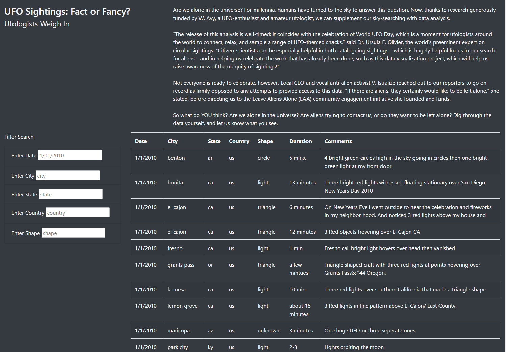
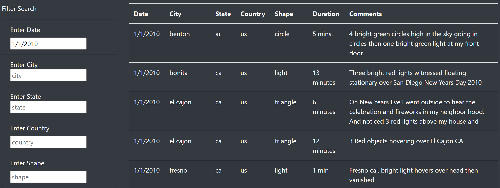
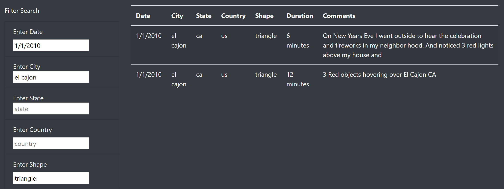

# UFOs

## Overview of Project
The purpose of this assignment was to add additional filters to the table and be able to filter the data using multiple criterion instead of just one. Before, a user could only filter the data by date only. Now the user will be able to filter by date, city, state, country and shape. By updating this table using html and javascript, we are now allowing users to filter by multiple criteria at once. 

## Results
Before we altered the html and javascript files, a user could only search the table by click when clicking on the submit button. To begin altering, we removed the submit button and added 4 additional filter lists to the index file using html. Then we refreshed our html page and 5 search filter boxes are shown.

After we created the filter search boxes in html, we then went back to our app.py file and adjusted the javascript function so the table would return filtered data of all 5 criteria.  Next, we called the function and rebuilt the table.  Then, we coded the function to rebuild the table with the filtered data. To do this, we had to use a for loop with object.entries to iterate through each criteria to capture the key and value out of the dictionaries, and then use an arrow function to make sure it equaled what the user was inputting as the filter.  Lastly, we tested the data using multiple filters to make sure the table was filtering correctly. 

Someone now can use this webpage to filter by date, city, state, country or shape. The user would have to specify a specific date, city , state, country or shape they are looking for by typing an input into the filter search box which would return all filtered results of that input into the table.

They can also filter by multiple criteria with all multipe criteria at once. A user could select by date, city, **AND** country to see a more narrow filter with multiple criterion. To do this, a user would input a specific date into the date search filter box, a specific city into the city search filter box **AND** a specific country into a search filter box.  Then the table would return results that met all 3 criteron. 

### Summary

One drawback of this design is that it does not have a submit button or any text letting you know your filtered data will return.  You will have to assume to press enter in order to see the filtered data. Another drawback of this design is that the datetime function is specific to the format of MM-MM-YYYY to return data. Lastly, all the other filters are case sensitive which means the user will have to use the same case the function is written in.

Two recommendations for this design would be to add a filter for duration and remove the filter for country since all the UFO sightings are in the US.  To enhance this design,  we could expand the filtering to select the data between two dates. Also we could also add a greater than or less than filtering option for duration to add more advanced sorting.

